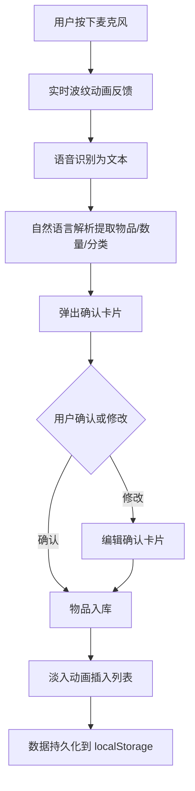

## 1. 产品概述

收纳管家是一款移动优先的家用物品清点管理应用，通过语音识别+自然语言解析实现"说出来就能记"的极简收纳体验。用户只需按住麦克风说出物品信息，系统自动提取名称、数量和分类，一键入库，彻底告别手动录入的繁琐。

- 目标用户：搬家打包、日常收纳整理、家庭物品管理的用户
- 核心价值：语音极速录入 → 智能分类 → 永久保存，打造最轻松的家居清点闭环

## 2. 核心功能

### 2.1 用户角色

| 角色 | 注册方式 | 核心权限 |
|------|----------|----------|
| 普通用户 | 无需注册，本地使用 | 全部功能 |

### 2.2 功能模块

1. **首页（物品清单）**：全局搜索、分类筛选、物品卡片列表、语音录入入口
2. **物品详情/编辑**：查看和修改物品名称、数量、存放位置、分类标签

### 2.3 页面详情

| 页面名称 | 模块名称 | 功能描述 |
|----------|----------|----------|
| 首页 | 顶部搜索栏 | 支持按物品名称、位置模糊搜索，实时过滤 |
| 首页 | 分类标签流 | 横向滚动标签（厨房/卧室/客厅/卫浴/书房/日用品/其他），点击切换筛选 |
| 首页 | 物品卡片列表 | 每张卡片展示物品缩略图图标、名称、数量、存放位置、分类标签，支持左滑删除 |
| 首页 | 底部语音录入按钮 | 固定悬浮的超大麦克风按钮，长按录音/点击切换，带实时波纹反馈 |
| 首页 | 语音确认弹窗 | 识别完成后弹出轻量级确认卡片，显示解析结果，支持修改后入库 |
| 首页 | 统计概览条 | 顶部显示物品总数、分类数量等简要统计 |

## 3. 核心流程

**语音录入主流程**：用户按下麦克风 → 实时波纹动画反馈 → 语音识别为文本 → 自然语言解析提取物品/数量/分类 → 弹出确认卡片 → 用户确认或修改 → 物品入库（淡入动画）→ 数据持久化到 localStorage

**手动录入流程**：点击"+"按钮 → 填写物品信息表单 → 确认入库

**搜索筛选流程**：输入关键词/点击分类标签 → 实时过滤列表 → 展示匹配结果

## 4. 用户界面设计

### 4.1 设计风格

- 主色：#4A90E2（宁静蓝），传达温馨、有条理的家居感
- 强调色：#FF6B6B（珊瑚红），用于语音按钮和重要操作
- 辅助色：#F5F7FA（浅灰背景）、#FFFFFF（卡片白）
- 按钮风格：圆角胶囊按钮，语音按钮为超大圆形带阴影
- 字体：思源黑体 / Noto Sans SC，标题 18px 加粗，正文 14px 常规，辅助 12px
- 布局：卡片流式布局，大量留白，信息层级清晰
- 图标风格：线性极简图标（Lucide Icons），2px 描边

### 4.2 页面设计概览

| 页面名称 | 模块名称 | UI 元素 |
|----------|----------|---------|
| 首页 | 顶部搜索栏 | 圆角输入框 + 搜索图标，浅灰背景，内边距充足 |
| 首页 | 分类标签流 | 横向滚动胶囊标签，选中态蓝色填充，未选中白底蓝边 |
| 首页 | 物品卡片列表 | 白色圆角卡片，左侧分类图标，右侧物品信息，底部位置标签 |
| 首页 | 语音录入按钮 | 固定底部居中，64px 圆形，珊瑚红渐变，白色麦克风图标，脉冲波纹动画 |
| 首页 | 语音确认弹窗 | 底部滑出半屏弹窗，毛玻璃背景，解析结果卡片列表，确认/修改按钮 |
| 首页 | 统计概览条 | 顶部横条，显示物品总数和分类数，浅蓝背景 |

### 4.3 响应式设计

- 移动优先策略：默认 375px 宽度设计，最大内容宽度 480px 居中
- 平板适配：768px 以上双栏布局，左侧分类导航 + 右侧物品列表
- 桌面适配：1024px 以上三栏布局，左侧分类、中间列表、右侧详情
- 触摸优化：按钮最小点击区域 44px，语音按钮 64px

### 4.4 动效设计

- 语音波纹：按下麦克风时，3层同心圆脉冲扩散动画，opacity 从 0.6 渐隐
- 物品入库：fadeInUp 动画，从下方 20px 淡入上滑，时长 300ms
- 分类切换：列表淡出→淡入过渡，时长 200ms
- 卡片交互：hover 微上浮 + 阴影加深，左滑露出删除按钮
