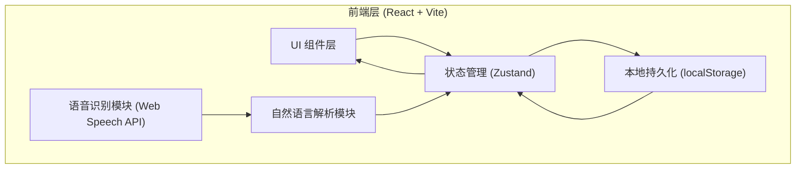
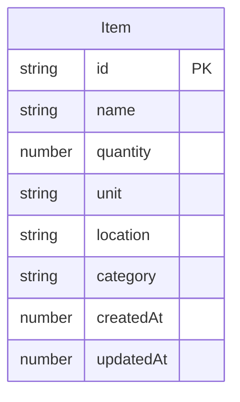

## 1. 架构设计



纯前端架构，无后端依赖。所有数据通过 localStorage 持久化，语音识别使用浏览器原生 Web Speech API。

## 2. 技术说明

- 前端：React 18 + TypeScript + Tailwind CSS 3 + Vite
- 初始化工具：vite-init
- 后端：无（纯前端应用）
- 数据库：无（使用 localStorage + Zustand 状态管理）
- 语音识别：Web Speech API（浏览器原生）
- 图标库：lucide-react

## 3. 路由定义

| 路由 | 用途 |
|------|------|
| / | 首页，物品清单主界面，包含搜索、分类、列表和语音录入 |

单页应用，所有功能集中在首页通过状态切换和弹窗交互完成。

## 4. API 定义

无后端 API。所有数据操作通过 Zustand store 完成：

```typescript
interface Item {
  id: string
  name: string
  quantity: number
  unit: string
  location: string
  category: Category
  createdAt: number
  updatedAt: number
}

type Category = 'kitchen' | 'bedroom' | 'living' | 'bathroom' | 'study' | 'daily' | 'other'

interface ItemStore {
  items: Item[]
  searchQuery: string
  activeCategory: Category | 'all'
  addItem: (item: Omit<Item, 'id' | 'createdAt' | 'updatedAt'>) => void
  updateItem: (id: string, updates: Partial<Item>) => void
  deleteItem: (id: string) => void
  setSearchQuery: (query: string) => void
  setActiveCategory: (category: Category | 'all') => void
  getFilteredItems: () => Item[]
}
```

## 5. 核心模块设计

### 5.1 语音识别模块

```typescript
interface VoiceModule {
  isListening: boolean
  transcript: string
  startListening: () => void
  stopListening: () => void
  onResult: (callback: (text: string) => void) => void
}
```

- 使用 `window.SpeechRecognition` 或 `window.webkitSpeechRecognition`
- 语言设置为 `zh-CN`
- 开启 `continuous = true` 和 `interimResults = true`
- 监听 `onresult` 事件获取识别文本

### 5.2 自然语言解析模块

```typescript
interface ParsedItem {
  name: string
  quantity: number
  unit: string
  category: Category
}

function parseVoiceInput(text: string): ParsedItem[]
```

解析规则：
- 数量提取：正则匹配中文数字（一口、两个、三把、四套）和阿拉伯数字
- 分类推断：基于关键词映射（锅/碗/筷 → kitchen，床/被/枕 → bedroom 等）
- 名称提取：去除数量词后的剩余文本作为物品名称

### 5.3 数据持久化

- 使用 Zustand 的 `persist` 中间件
- 存储键名：`shouna-guanjia-items`
- 自动序列化/反序列化 JSON
- 页面加载时自动恢复数据

## 6. 数据模型

### 6.1 数据模型定义



### 6.2 初始数据

预置示例物品数据，帮助用户理解应用功能：

```json
[
  { "name": "炒锅", "quantity": 2, "unit": "口", "location": "厨房橱柜", "category": "kitchen" },
  { "name": "汤锅", "quantity": 3, "unit": "个", "location": "厨房橱柜", "category": "kitchen" },
  { "name": "筷子", "quantity": 1, "unit": "套", "location": "厨房抽屉", "category": "kitchen" },
  { "name": "米桶", "quantity": 1, "unit": "个", "location": "厨房角落", "category": "kitchen" }
]
```

分类关键词映射：

```json
{
  "kitchen": ["锅", "碗", "筷", "勺", "盘", "刀", "砧板", "米", "油", "盐", "酱", "醋", "冰箱", "微波炉", "烤箱"],
  "bedroom": ["床", "被", "枕", "毯", "衣柜", "床头柜", "梳妆台"],
  "living": ["沙发", "茶几", "电视", "空调", "地毯", "窗帘"],
  "bathroom": ["毛巾", "牙刷", "沐浴", "洗发", "马桶", "花洒"],
  "study": ["书", "笔", "电脑", "打印机", "书架", "台灯"],
  "daily": ["纸巾", "洗衣", "拖把", "扫帚", "垃圾", "电池"]
}
```
